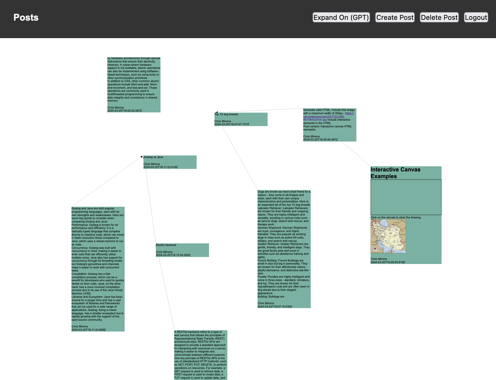
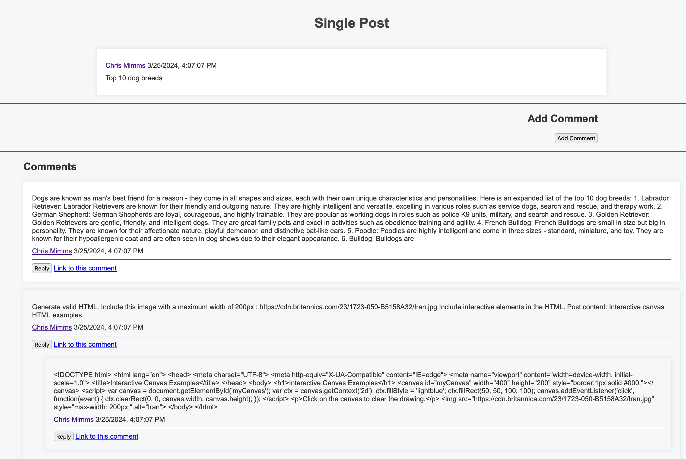

# Post-Service

## Overview

This was personal project developed to get more experience with Node.js and Postgres. I wanted to play around with creating a flexible data model while creating RESTful APIs and integrating with an LLM api.

## Features

- **REST API for Posts**: 
- **Views**:
  - **Canvas Graph View**: An infinitely scrolling shared canvas that supports arbitrary HTML or Markdown in each post. Posts can be linked arbitrarily, layout by D3.js
  - **User Pages**: All posts authored by user
  - **Post Views with Nested Comments**: Threaded discussion view of a single post, similar to Reddit.

## Screenshots
### Canvas

### Single post view

## Setup and Installation

Use the included devcontainer on github or in VSCode for local development.
